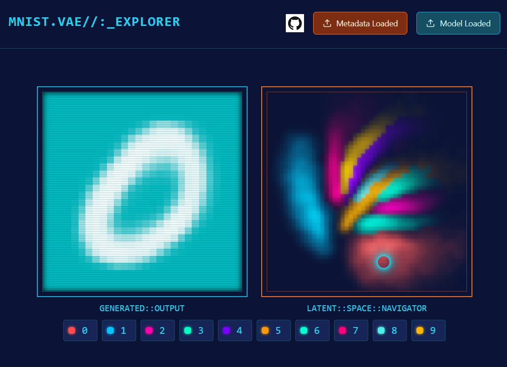

# Latent Space Explorer

A web-based interactive tool for exploring the latent space of a Variational Autoencoder (VAE) trained on the MNIST dataset.

<div align="center">

**[Try it online here](https://cpldcpu.github.io/LatentSpaceExplorer/)**

</div>

[](https://cpldcpu.github.io/LatentSpaceExplorer/)

## Overview

This project was inspired by [N8's implementation](https://n8python.github.io/mnistLatentSpace/) and developed as a "speed-prompting" exercise using Claude Artifact and GitHub Copilot's editing capabilities. The entire implementation, including training, took approximately 2.5 hours.

### Tech Stack
- Frontend: TypeScript, React, Tailwind CSS, Vite
- Inference: ONNX Runtime
- Training: PyTorch
- Deployment: Based on [Neural Network Visualizer](https://github.com/cpldcpu/neural-network-visualizer)

The UI features a cyberpunk-inspired design created with Claude's assistance.

## Features

The application consists of two main components:
1. **Latent Space Explorer**: Visualizes the distribution of the latent space in 2D projection, with colors indicating digit classes
2. **VAE Model Viewer**: Generates images from selected points in the latent space

## Implementation Details

### Training
The training code is located in the `train` directory:
- `train.py`: Trains the VAE and saves checkpoints and test images
- `export_vae_2_onnx.py`: Converts checkpoint to ONNX format and exports latent space data as msgpack/JSON

### Neural Network Architecture

The VAE implementation features:
- Encoder with three convolutional layers
- Two-dimensional latent space
- Decoder with two full-resolution layers for improved output clarity

Interestingly, this was one of the parts that was messed up by Claude, so I had to manually fix the padding and channels. Certainly, a smaller model would have also done the job. Having two layers at full resolution in the decoder turned out to be crucial to avoid too blurry output.

```python
    # Encoder
    self.encoder = nn.Sequential(
        nn.Conv2d(1, 32, 3, stride=1, padding=1),  
        nn.BatchNorm2d(32),
        nn.ReLU(),
        nn.Conv2d(32, 32, 3, stride=2, padding=1),  
        nn.BatchNorm2d(32),
        nn.ReLU(),
        nn.Conv2d(32, 32, 3, stride=2, padding=1),  
        nn.BatchNorm2d(32),
        nn.ReLU(),
        nn.Flatten()
    )
    
    # Latent space
    self.fc_mu = nn.Linear(32 * 7 * 7, latent_dim)
    self.fc_var = nn.Linear(32 * 7 * 7, latent_dim)
    
    # Decoder
    self.decoder_input = nn.Linear(latent_dim, 32 * 7 * 7)
    
    self.decoder = nn.Sequential(
        nn.ConvTranspose2d(32, 32, 3, stride=2, padding=1,output_padding=1),  
        nn.BatchNorm2d(32),
        nn.ReLU(),
        nn.ConvTranspose2d(32, 32, 3, stride=2, padding=1,output_padding=1),  
        nn.BatchNorm2d(32),
        nn.ReLU(),
        nn.ConvTranspose2d(32, 1, 3, stride=1, padding=1), 
        nn.Sigmoid()
    )
```

## Building

The core code can be found in [`webcode/src/pages/index.tsx`](webcode/src/pages/index.tsx). I used [Claude Artifacts Starter](https://github.com/EndlessReform/claude-artifacts-starter) as a harness to deploy the artifact to a github.io page.

All web code is in the `webcode` directory. Read Claude Artifacts Starter's [README](webcode/README.md) for more information.
